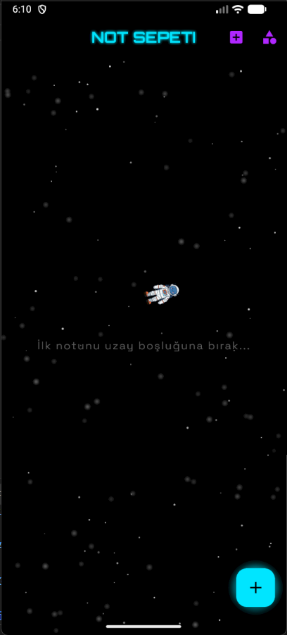
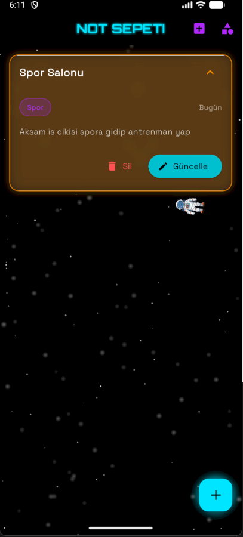
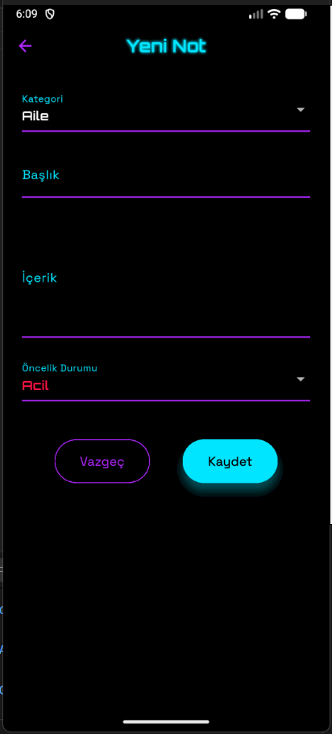

# Not Sepeti (Not Defteri) 🚀🌌

Flutter ile geliştirilmiş, SQLite yerel veritabanı altyapısına sahip, yenilikçi ve büyüleyici bir **uzay temalı** not alma uygulaması. Klasik not defteri mantığını, `CustomPaint` ve gelişmiş Flutter animasyonları kullanarak derinlik hissi veren dinamik bir görsel şölenle birleştirir.

## 📸 Ekran Görüntüleri

Uygulamanın arayüz tasarımı ve boş/dolu durumlarındaki ekran görüntüleri:

<div align="center">
  
  
  
</div>

<div align="center">
  
</div>

## ✨ Öne Çıkan Özellikler

* **Gelişmiş Not ve Kategori Yönetimi:** Notlarınızı başlık, içerik ve oluşturulma/düzenlenme zamanıyla kaydedin. Notları kategorilere ayırarak kolayca yönetin.
* **Tamamen Yerel Depolama (Offline-First):** `sqflite` entegrasyonu sayesinde verileriniz cihazınızda güvenle saklanır, internet bağlantısı gerektirmez.
* **Büyüleyici Uzay Teması Deneyimi:**
  * 🌟 **Starfield Arka Planı (`StarfieldPainter`):** `CustomPainter` kullanılarak sıfırdan yazılan, ekranda derinlik hissi yaratan ve sürekli akan dinamik yıldız tarlası efekti.
  * 👨‍🚀 **Zıplayan Astronot (`BouncingAstronaut`):** Sayfalarda serbestçe süzülen ve animasyon döngüsüne sahip sempatik astronot widget'ı.
  * 🔘 **Parlayan Buton (`GlowingFAB`):** Dışa doğru neon ışık efekti yayan, temaya uygun özel tasarım Floating Action Button.
* **Akıllı Tarih Formatlama (`DateFormatter`):** Notların ne zaman yazıldığını veya güncellendiğini kullanıcı dostu bir formatta gösterir.
* **Modern ve Karartılmış Tema (`AppTheme`):** Gözü yormayan, uzay derinliğini yansıtan derin gece mavisi ve mor tonlarında özel renk paleti.

## 📂 Proje Klasör Yapısı

Proje, genişletilebilir ve temiz kod prensiplerine (Clean Code) uygun olarak katmanlı bir mimariyle tasarlanmıştır:

```text
lib/
├── models/          # Veri katmanı ve nesne modelleri
│   ├── category_model.dart      # Kategori veri şablonu
│   └── note_model.dart          # Not veri şablonu ve veri tabanı dönüşümleri
├── screens/         # Kullanıcı arayüzü (UI) sayfaları
│   ├── home_screen.dart         # Notların listelendiği, filtreleme yapılan ana ekran
│   └── add_edit_note_screen.dart# Yeni not ekleme ve mevcut notları düzenleme ekranı
├── services/        # Alt yapı ve harici servisler
│   └── db_helper.dart           # SQLite bağlantı yönetimi ve CRUD (Ekle/Sil/Güncelle) işlemleri
├── utils/           # Yardımcı araçlar ve global konfigürasyonlar
│   ├── app_theme.dart           # Uygulama renk paleti, yazı stilleri ve tema detayları
│   └── date_formatter.dart      # Zaman damgalarını okunabilir kılan yardımcı sınıf
├── widgets/         # Temaya özel üretilmiş, tekrar kullanılabilir animasyonlu bileşenler
│   ├── bouncing_astronaut.dart  # Süzülen astronot animasyonu
│   ├── glowing_fab.dart         # Parlama efektli özel aksiyon butonu
│   └── starfield_painter.dart   # CustomPaint ile çizilen hareketli yıldızlar arka planı
└── main.dart        # Uygulamanın başlangıç ve initialization noktası
